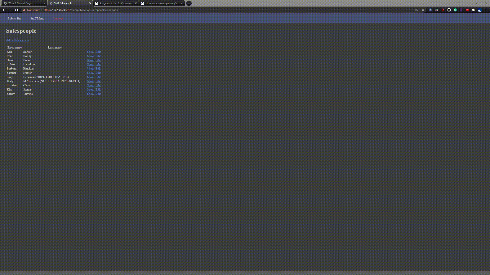
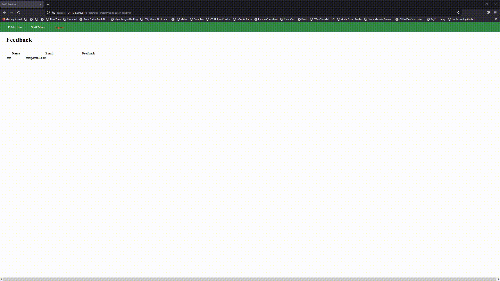

# Project 8 - Pentesting Live Targets

Time spent: **4** hours spent in total

> Objective: Identify vulnerabilities in three different versions of the Globitek website: blue, green, and red.

The six possible exploits are:

* Username Enumeration
* Insecure Direct Object Reference (IDOR)
* SQL Injection (SQLi)
* Cross-Site Scripting (XSS)
* Cross-Site Request Forgery (CSRF)
* Session Hijacking/Fixation

Each color is vulnerable to only 2 of the 6 possible exploits. First discover which color has the specific vulnerability, then write a short description of how to exploit it, and finally demonstrate it using screenshots compiled into a GIF.

## Blue

Vulnerability #1: Session Hijacking

Description: We're able to obtian a user's session ID, change our current ID to that obtained ID in order to gain
access to their session.

Vulnerability #2: SQL Injection

Description: Double quotes don't work, only single quotes in this case. Attempting a SQL injection uses sleep results
in the web page being unresponsive for the time we set, 3 seconds in the first case and 1 second in the
second case.

## Green

Vulnerability #1: Username Enumeration

Description: Every time a user attempts to log-in, there will be a prompt displaying whether the log-in has been
unsuccesful, in the event a valid username attempts to log in, the text that states whether log-in has
been unsuccesful will be bolded if the username is a valid one.

Vulnerability #2: Cross-Site Scripting

Description:

Using the alert method from JavaScript we're able to succesfully display a text box when an administrator views
any feedback sent, therefore a user would be able to replicate this using malicious JavaScript code.

## Red

Vulnerability #1: Cross-Site Request Forgery

Description: Using an HTML form that will edit someone belonging to the salespeople category, in this case we edit
their first and last name to be something else. The change will be reloaded when the page is reloaded.

Vulnerability #2: Insecure Direct Object Reference

Description: A salesperson which should not be visible to the public until a later date is able to be accessed by a user
by simply changing the current ID they are viewing in the URL.

## Notes

Describe any challenges encountered while doing the work
